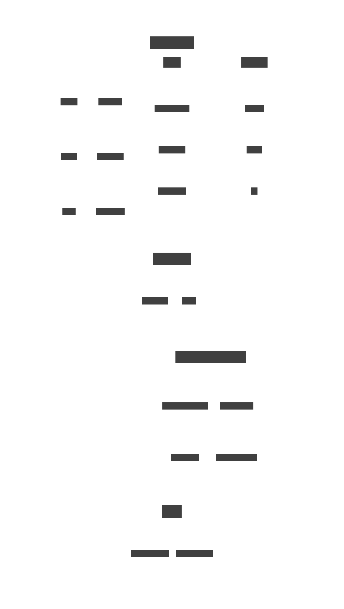

# ERP
[](https://app.fossa.com/projects/git%2Bgithub.com%2Fjhdcruz%2Fmancave-oms?ref=badge_shield)


## Structure



## Development

### Prerequisites

- [Node.js LTS](https://nodejs.org/en)
- [PNPM](https://pnpm.io/installation#using-winget)
- Supabase Credentials

### Setup

1. Clone and install deps:

   ```bash
   git clone https://github.com/jhdcruz/erp.git --depth 10 && cd erp & pnpm i
   ```

2. You'll need a Supabase credentials:

   - Shared in GC; or,
   - Create your own [via the Supabase dashboard](https://database.new)

3. Rename `.env.local.example` to `.env.local` and update the following:

   ```
   NEXT_PUBLIC_SUPABASE_URL=[INSERT SUPABASE PROJECT URL]
   NEXT_PUBLIC_SUPABASE_ANON_KEY=[INSERT SUPABASE PROJECT API ANON KEY]
   ```

   Both `NEXT_PUBLIC_SUPABASE_URL` and `NEXT_PUBLIC_SUPABASE_ANON_KEY` can be found
   in [your Supabase project's API settings](https://app.supabase.com/project/_/settings/api).

4. You can now run the Next.js local development server:

   ```bash
   pnpm dev
   ```

> Check out [the docs for Local Development](https://supabase.com/docs/guides/getting-started/local-development) to also
> run Supabase locally.


## License
[](https://app.fossa.com/projects/git%2Bgithub.com%2Fjhdcruz%2Fmancave-oms?ref=badge_large)